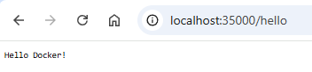
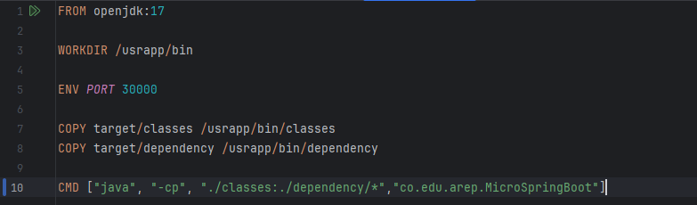
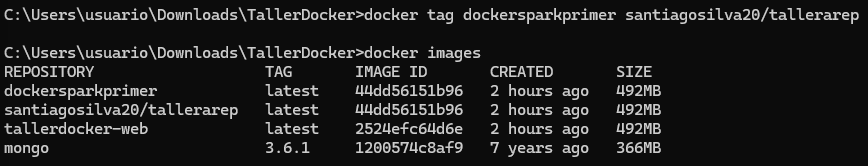
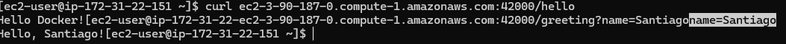

## Taller de de modularización con virtualización e Introducción a Docker - Laboratorio 4

Este taller tiene como objetivo integrar diferentes herramientas y tecnologías usadas en el desarrollo y despliegue de aplicaciones modernas.
La idea principal es construir una aplicación web sencilla sin usar SpringBoot, empacarla en un contenedor Docker y desplegarla tanto en la máquina local como en una instancia EC2 de AWS.

## Caracteristicas 

Desarrollar una aplicación básica con Spring Boot.

Crear un Dockerfile y un docker-compose para empaquetar y correr la aplicación en contenedores.

Publicar la imagen en Docker Hub para su distribución.

Desplegar la aplicación en una máquina virtual en AWS EC2, instalando y configurando Docker en el servidor remoto.

## Instalación y Ejecución

```
# 1. Clonar el repositorio
git clone https://github.com/SantiagoSilva200/Taller4AREP

# 2. Navegar al directorio del proyecto
cd Taller4AREP

# 3. Compilar el proyecto con maven

mvn clean install

# 4. Ejecuta el servidor

java -cp "target/classes;target/dependency/*" co.edu.arep.MicroSpringBoot

```

Una vez ejecutado, abrir: http://localhost:35000/hello



## Creación imagen Docker 

1. En la raíz del proyecto crear un archivo denominado Dockerfile



2. Ejecutar "docker build --tag dockersparkprimer ." y verificar que la imagen fue construida


3. Creación 3 instancias de contenedores Docker independientes

```
docker run -d -p 34000:6000 --name firstdockercontainer dockersparkprimer
docker run -d -p 34001:6000 --name firstdockercontainer2 dockersparkprimer
docker run -d -p 34002:6000 --name firstdockercontainer3 dockersparkprimer
```


4. Asegurarnos que el contenedor esta corriendo 


5. Abrir el navegador y acceder a los puertos expuestos para verificar que este corriendo 
correctamenete


6. En la raíz del proyecto crear un archivo denominado docker-compose.yml y ejecutar el comando "docker-compose up -d" 


## Subir la imagen a Docker Hub

1. Crear un repositorio 


2. Crear referencia a la imagen con el nombre del repostitorio anteriormente creado con el comando "docker tag dockersparkprimer santiagosilva20/tallerarep" y verificar que la nueva referencia existe.



3. Autenticarse en la cuenta y hacer push de la imagen al repositorio en DockerHub, con el siguiente comando "docker push santiagosilva20/tallerarep:latest"


## Despliegue en AWS

1. Crear una maquina virtual EC2 


2. Nos conectamos a través de SSH a la maquina virtual, despues de haber creado una llave .pem para acceder. 


3. Instalamos docker e iniciamos el servicio con los siguientes comandos:

```
sudo yum update -y
sudo yum install docker
sudo service docker start
```


4. Creamos y ejecutamos un contenedor a partir de la imagen santiagosilva20/tallerarep, apeando el puerto 42000 de tu máquina al 6000 del contenedor, con el siguiente comando "docker run -d -p 42000:6000 --name firstdockerimageaws santiagosilva20/tallerarep"


5. Creamos una regla de entrada para permitir el trafico sobre el puerto mapeado de la maquina para poder acceder al servicio. 


6. Entramos a la URL que nos brinda el DNS publico de nuestro EC2 para verficar que responde correctamente al despliegue de nuestra aplicacion. 


Tambien verificamos la conexion desde el EC2 con curl. 




## Tecnologías

Java 17 + 

Maven para gestión de build

Docker 

AWS

## Autor

Taller desarrollado por Santiago Silva Roa 